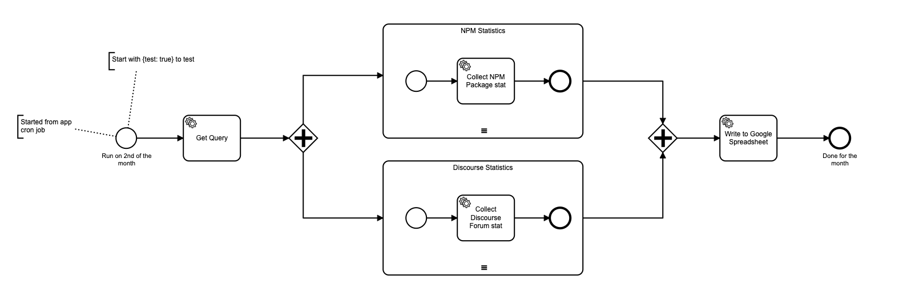

# Stats Collector

A stats collector that runs on a schedule and updates a Google Sheet.

## Environment variables

There is a file `.env.template`. You need to make a copy of this file to `.env` and populate it.

You need to set the connection variables for a Camunda Cloud connection in there. 

The Google credential setup is [here](https://theoephraim.github.io/node-google-spreadsheet/#/getting-started/authentication?id=service-account).

## Configuration

The file `src/config.json` contains the collection configuration.

Config file values like this: `${{ZEEBE_FORUM_API_KEY}}` are replaced by the process environment variable with that name at runtime.

The `rename` mapping is used to map the metric names returned from the remote API to specific names for the query.

## Deployment

You can use the command `npm run docker:start` to build and start the stats collector as a Docker container. It will start in detached mode, but with the logs streaming.

To stop the container, hit Ctrl-C to stop the log stream, and use the command `npm run docker:stop`.

To reattach to the log stream, use `npm run docker:logs`.

## BPMN

